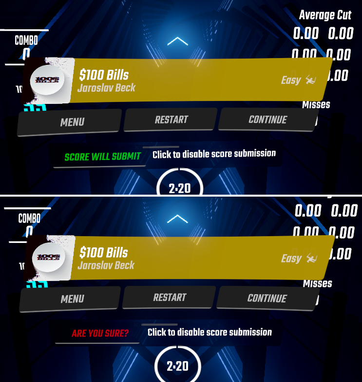

# PlayFirst(SubmitLater)

**Allows for automated elective score submission, including preventing submission of failed NF scores. For BS 1.16.4.**

Ever received trolly requests that you regret entertaining and now you have crap all over your ScoreSaber? Or is 14star OV forever dragging down your rank acc because your friends ran the map in MP (back in the day) while you went to eat? Now you can stop it from happening again!
This mod means you can play all the shitmaps and practice high stars with reckless abandon. No longer will you scream when finally pass OV but it was in practice mode or when you didn't manage to click Pause fast enough to quit a bad map.

# How To Use

- **Pause Menu UI:** Allows you to disable score submission from the Pause Menu. Button shows current state of Score Submission. Click twice (safety feature) to disable score for your current run. Your decision for the run is final so choose wisely :) To enable UI, toggle ON "Submit Later" and go into a map at least once (not required to keep toggled thereafter).
- **Submit Later:** Automatically pauses at the end of the map so you can make your decision. _You can disable score and still keep your BeatSavior/Slice Visualizer/etc data if you click continue and finish the map._ Automatic pausing is only for Solo Mode.
- **NoFail Protection:** Stops score submission if you fail while playing on NF. Not enabled in Campaigns as some missions require NF.
- **Disable All Score Submission:** No scores will be set. For all modes.
- **The toggles "stack".** You can enable any combination so use your judgement xD
- **Note:** If your map has blocks in the last fractions of a second, Submit Later will still pause if toggled ON. This will never be an issue for Rank, for shitmaps use your judgement :)
- Place PlayFirst.dll in Plugins folder. Disabled scores will not be set locally or submitted to ScoreSaber.
- Requires BSIPA, BSML, BS_Utils




# About

This is my second mod and written mostly from scratch. If you enjoy this, please feel free to let me know :) I appreciate your feedback!

# Developing and Maintaining

> It is advised to have a separate (dedicated) Beat Saber copy specifically for mod development. This is achievable by having a separate launcher such as [Beat Saber Legacy Launcher](https://bslegacy.com/).

Before opening the project for the first time, you should set up `PlayFirst.csproj.user` (user-specific `PlayFirst.csproj`) which contains the following XML:

```xml
<?xml version="1.0" encoding="utf-8"?>
<Project>
  <PropertyGroup>
    <BeatSaberDir>path_to_beat_saber</BeatSaberDir>
  </PropertyGroup>
</Project>
```

`path_to_beat_saber` should be pointed towards your Beat Saber directory. This defaults to `C:\Program Files (x86)\Steam\steamapps\common\Beat Saber`. The build system will automatically handles the build tasks and copies the desired `dll` file to your plugin directory. Release builds will also automatically generates BeatMods `zip` and final `dll` file under `bin\Release` directory.
